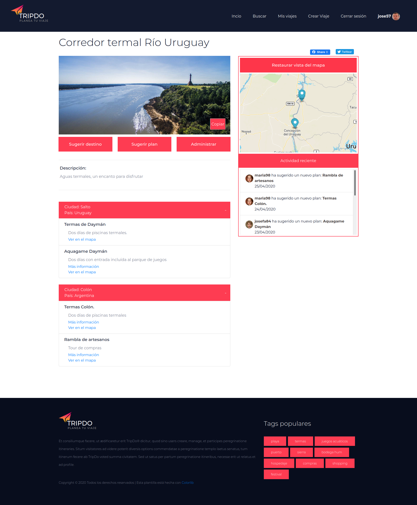

# Laboratorio PHP - 2020

## Integrantes:

+ Carlos Balbiani
+ Lucas Garrido
+ Juan Álvarez
+ Julio Arrieta

## Problema planteado

Hoy en día Internet se utiliza cada vez más en diferentes tipos de actividades, por distintos tipos de usuarios con diversos intereses. Una de las pasiones más grandes que los usuarios de Internet comparten es el viajar por el mundo, para lo cual existen actualmente numerosos sitios que permiten planificar el itinerario de los viajes, entre ellos: InspireRock (www.inspirock.com), TripIt (www.tripit.com), etc.

El sistema a construir será un Planificador de Viajes denominado TripDo®, que permite a los usuarios crear, gestionar y compartir itinerarios de viajes.

Los visitantes del sitio podrán visualizar las diferentes opciones de viajes recomendadas por la plataforma, así como los itinerarios más votados por la comunidad TripDo. Sin embargo para poder comenzar a crear un itinerario de viaje será necesario estar registrado y contar con un perfil.

Existen 2 roles para los usuarios registrados: viajero o colaborador. Una vez registrado un usuario puede ejercer de los dos roles indistintamente.

De cada usuario interesa saber su nickname (único), su email (único), teléfono, nombre completo, imagen, y una pequeña biografía. Cualquier usuario puede crear un viaje a realizar, para ello debe indicar nombre, descripción y si desea que sea privado o no. En la siguiente imagen se puede apreciar.

Una vez creado el viaje, el usuario tendrá la opción de compartirlo con quienes considere, ya sea en calidad de viajeros o de colaboradores. Los colaboradores serán usuarios que podrán ayudar a planear el viaje, ellos podrán sugerir ciudades y planes para hacer. En cambio los viajeros podrán además de las opciones anteriores, aprobar las sugerencias realizadas para ese viaje, así como invitar a más viajeros.

Para cada viaje a realizar, tanto colaboradores como viajeros podrán agregar destinos y planes. Para que un destino o plan sea incluido en el viaje deberá ser votado por todos los viajeros de ese viaje.

De cada plan interesa nombre, descripción, ubicación, link (opcional).

De los destinos en cambio interesa únicamente país, ciudad y sitios históricos o populares.

La finalidad de compartir los viajes públicamente es para que los usuarios de la plataforma puedan elegir hacer los mismos viajes, por lo tanto, cada usuario podrá tomar un viaje existente y personalizarlo a su manera (por supuesto manejando una copia del original).

Por otra parte interesa calificar los viajes realizados y que estén en estado completo, de esta manera cada viajero brinda su opinión (una evaluación del 1 al 5 además de un texto opcional) y la comunidad puede saber más de él.

En la portada de cada viaje se tendrá un registro de todas las actividades realizadas en los últimos días, tanto ingreso de viajeros, colaboradores, planes, destinos, etc.

Además se listará cada actividad y el usuario podrá escoger cada una de ellas para ver el detalle.

También interesa disponer de un buscador en la portada de la plataforma, así como categorías (denominadas por #) para cada destino, de manera que se pueda buscar mas fácilmente. Los viajeros podrán compartir sus viajes (que aún no se hayan ejecutado) en sus redes sociales a fin de conseguir mas opiniones, en particular interesan Twitter y Facebook.

Por último se requiere el envío de emails para el registro de usuario (con confirmación) y para la funcionalidad invitar viajero o colaborador.

------------------------------

## Capturas del sitio creado

### Página de inicio

---

### Página de búsqueda

---

### Listado de viajes del usuario

---

### Visualizacion de viaje (1)

---

### Visualizacion de viaje (2)

---

